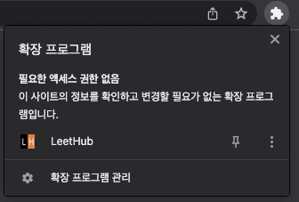
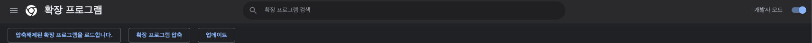
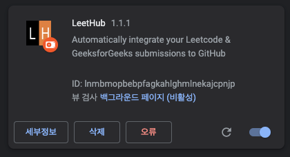

# Leet-Hub Setting

## 해당 문서 작성 이유
### 릿코드 문제 해결 시 해당 리포지토리에 ```릿코드 폴더/해결한 문제 폴더```가 아닌 ```해결한 문제 폴더``` 만 생성되어 다른 ```백준``` 또는 ```프로그래머스```와 같이 보기 힘들거 같아 해결 방법을 찾은 후 문서 작성

<br>

## 릿허브 세팅 방법
### 1. LeetHub 사이트 접속
https://github.com/QasimWani/LeetHub

### 2. 깃허브 컴퓨터로 클론
```shell
$ git clone https://github.com/QasimWani/LeetHub.git
```

### 3. Clone 한 ```LeetHub/scripts/leetcode.js``` 파일 수정
- 70번째 line 수정
#### - 원본
```javascript
const URL = `https://api.github.com/repos/${hook}/contents/${directory}/${filename}`;
```
#### - 수정본
```javascript
const URL = `https://api.github.com/repos/${hook}/contents/[원하는 폴더명]/${directory}/${filename}`;
```

### 4. 확장 프로그램 적용
#### 4-1. 확장 프로그램 관리 선택


<br>

#### 4-2. 우측 상단에 있는 개발자 모드 선택하여 모드 변경


<br>

#### 4-3. ```압축해제된 확장 프로그램을 로드합니다.``` 클릭 후 내 컴퓨터의 스크립트를 수정한 ```LeetHub``` 폴더 선택


#### 4-4. 적용 완료

- 오류는 무시