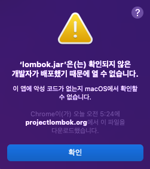
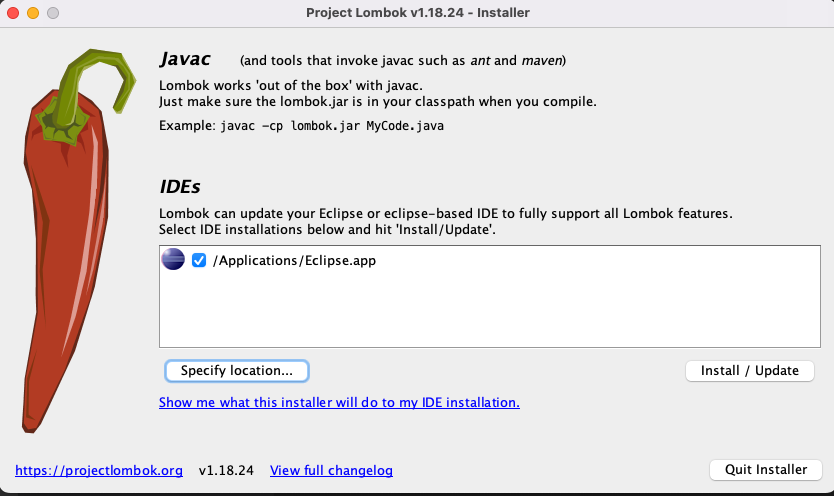
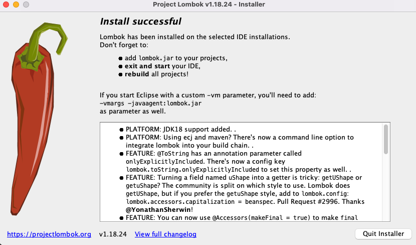

# Lombok Setting

## __1. Lombok.jar Download__
```
https://projectlombok.org/download
```
- 2022-05-11 기준 최신 버전 : 1.18.24

## __2. Lombok.jar 실행__

- 파일을 아이콘을 클릭하여 실행할 경우   

    ```
    그냥 실행할 경우 
    'lombok.jar'은(는) 확인되지 않은 개발자가 배포했기 때문에 열 수 없습니다. 
    문구가 뜨면서 에러가 날 것이다.
    해당 에러가 나면 터미널에서 실행한다.
    ```

### 터미널 실행
- 터미널 명령어
    ```bash
    java -jar lombok.jar
    ```


- __Install / Update__ 를 클릭하여 설치
- <span style="color:red">만약 IDEs에 선택된 IDE가 없을 경우</span>
  -  __Specify location__ 을 클릭하여 IDE를 찾아준다.



- 설치 완료가 된 것이므로 __Quit Installer__ 클릭

## __3. 설치 확인__
- 이클립스 패키지 내부 eclipse.ini 파일 확인
- 밑에 문구가 추가되어 있을 경우 설치가 성공적으로 된 것이다.
    ```bash
    -javaagent:/Applications/Eclipse.app/Contents/Eclipse/lombok.jar
    ```