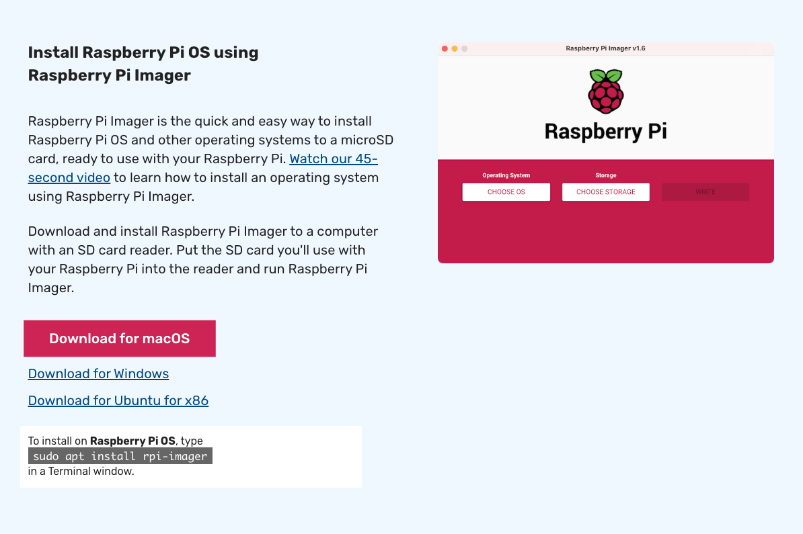
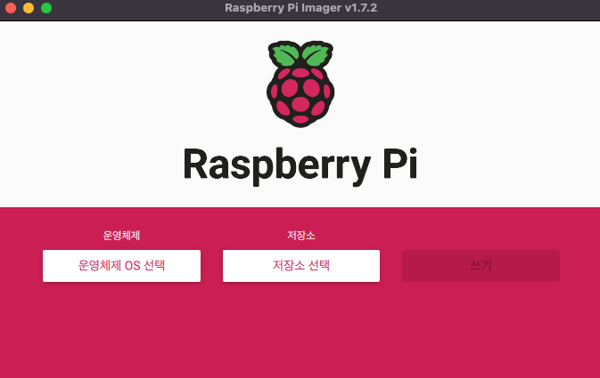

## 라즈베리파이 OS

### SD 카드 준비
> - 라즈베리파이에 들어가는거는 마이크로 sd 카드이나 일반적으로 컴퓨터에 연결하기 위해서는 SD 카드 어댑터가 필요하다.
> - 보통 마이크로 sd 카드를 구매하면 같이 들어있다.

### 라즈베리파이 OS 설치
> https://www.raspberrypi.com/software/



- SD카드에 설치하기

1. 운영체제 OS 선택에서 원하는 OS 선택
2. 저장소 선택에서 컴퓨터에 꽂아 넣은 SD 카드 선택
3. 1, 2번 과정을 거친 다음 쓰기 클릭
## 주의사항 : 해당 저장소를 완전 포맷하므로 중요 데이터가 있으면 백업 필수


### 라즈베리 파이 초기 계정
```shell
ID : pi
PW : raspberry
```

### GUI 환경에서 한글이 깨질 경우

```shell
$ sudo apt-get install fonts-unfonts-core
```
```shell
$ sudo apt-get install ibus ibus-hangul
... (Y/N) Y
```
```shell
$ sudo reboot
```