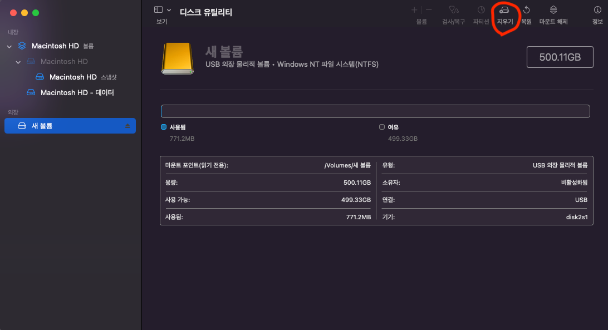
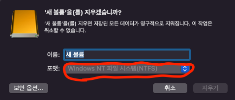
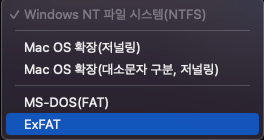
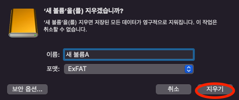

## 외장 하드 포맷 변경

### ```NTFS``` 포맷
#### - 맥에서는 외장 하드가 ```NTFS``` 방식 포맷일 경우 읽는 것은 가능하나 쓰는 것이 안 됩니다. 
#### - 그래서 맥 전용 지원 방식으로 변경하거나 아니면 맥과 윈도우 모두 지원하는 ```ExFAT``` 방식 포맷으로 변경해야 합니다.

### ```ExFAT``` 포맷으로 변경하기
#### - 이 방식으로 변경하려면 우선 외장하드의 데이터가 모두 리셋 되므로 파일이나 문서를 남길 것이 있으면 무조건 백업을 해야합니다.

## 포맷 변경 과정
### **1. <U>디스크 유틸리티 어플 실행**</U>
#### - ```Lanchpad```에서 디스크 유틸리티 어플을 찾아 실행시킵니다. 
####  

### **2. <U>지우기 버튼 클릭**</U>
#### - 지우기 버튼을 클릭합니다.
#### 

### **3. <U>포맷 콤보박스 클릭**</U>
#### - ```NTFS```라고 써있는 곳을 클릭합니다.
#### 

### **4. <U>```ExFAT``` 포맷 선택**</U>
#### - 맥과 윈도우를 지원하는 포맷인 ExFAT 포맷을 선택합니다.
#### 

### **5. <U>외장 하드 초기화**</U>
#### - 포맷 선택을 완료했으면 지우기 버튼을 클릭합니다.
#### 

### <U>**6. 끝**</U>
#### - 위의 일련의 과정을 거치면 윈도우에서만 쓰기가 가능하던 외장 하드를 맥에서도 쓸 수 있게 됩니다.

> ### 참고1) ```NTFS``` 포맷
> #### - New Technology File System
> #### - FAT32의 단점을 보완하기 위해 나온 포맷
> #### - 드라이브의 최대 크기는 256TB
> #### - 개별 파일 하나의 최대 크기는 16TB
> #### - <U>단점 : 호환성이 떨어진다.</U>
>  - 윈도우 위주의 형식이라 윈도우를 제외한 OS에서는 사용상 제한이 많다.
>  - 윈도우를 제외하고는 읽기만 가능하거나, 아니면 인식을 못 하는 경우가 발생할 수 있다.

> ### 참고2) ```ExFAT``` 포맷 
> #### - Extended File Allocation Table
> #### - NTFS의 호환성 문제를 극복하기 위해 나온 포맷
> #### - 드라이브와 개별 파일의 최대 크기의 제한은 없다.
> #### - <U>치명적인 단점 : 취약한 안정성</U>
> - ```USB 안전제거``` 등을 무시하고 그냥 USB를 뽑을 경우 파일이 날아간다든가 하는 문제점이 있을 수 있다.