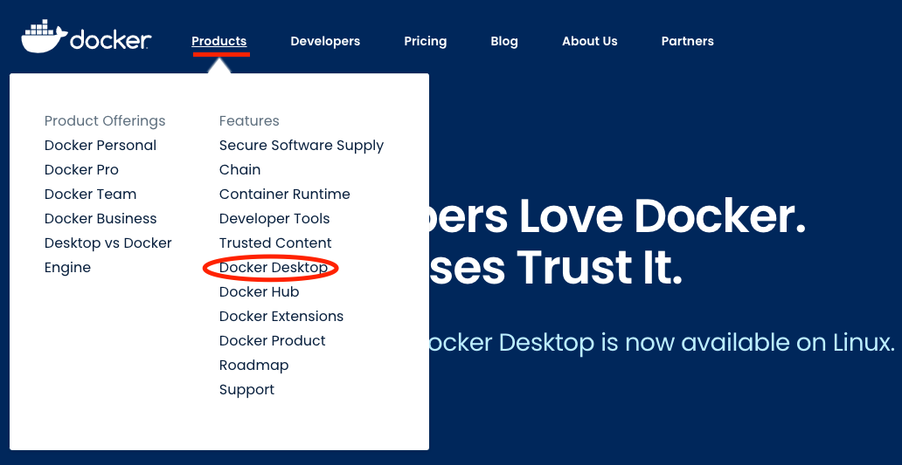
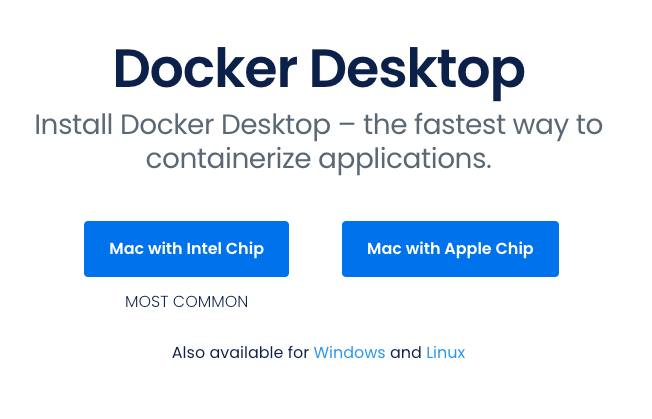
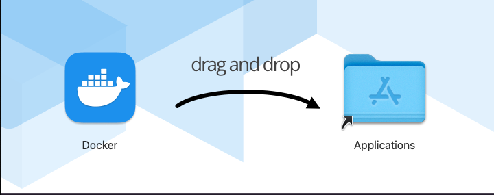
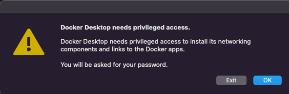
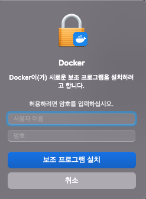
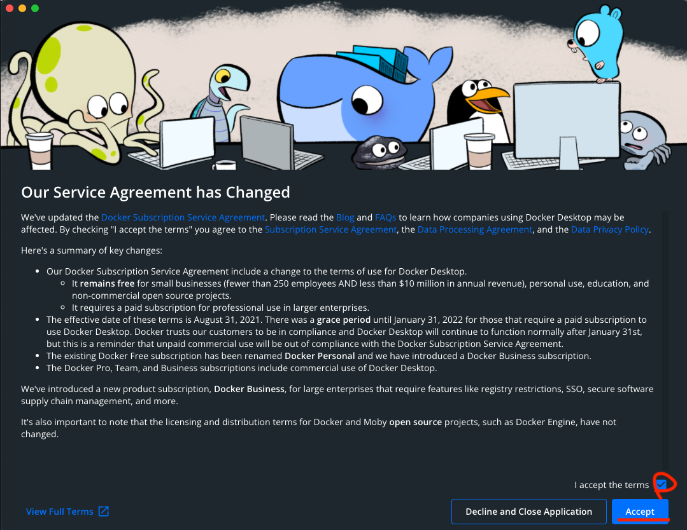
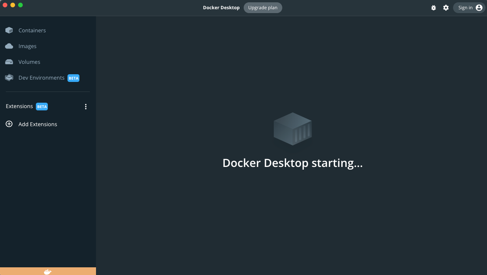

## 🐳 도커 세팅

### 1. 도커 설치

<details>

<summary>사이트에서 설치</summary>

### 1-1. 도커 사이트 접속
> https://www.docker.com/

### 1-2. Docker Desktop 페이지로 이동


### 1-3. CPU에 맞는 도커 설치

#### Mac With Intel Chip
- 인텔 : i3, i5, i7, i9, ...
#### Mac With Apple Chip
- M칩 : M1, M1 Pro, M1 Max, ...

### 1-4. 도커 설치

#### dmg 파일 다운 후 설치

</details>

<details>

<summary>터미널에서 설치</summary>

### 1-1. HomeBrew 설치
> [Homebrew-Setting.md 참고](/Mac-Setting/Homebrew-Settingbrew-Setting/Homebrew-Setting.md)

### 1-2. 도커 설치

```shell
$ brew install docker --cask
```

</details>

<br>

### 2. 도커 액세스 허용

#### ```OK```를 누르면 보조프로그램 설치하라는 창이 뜬다.

#### 사용자 이름 : 맥 PC 이름
#### 암호 : 맥 PC 암호

#### 체크박스 선택 후 ```Accept``` 버튼 클릭

<br>

### 3. 도커 설치 확인

